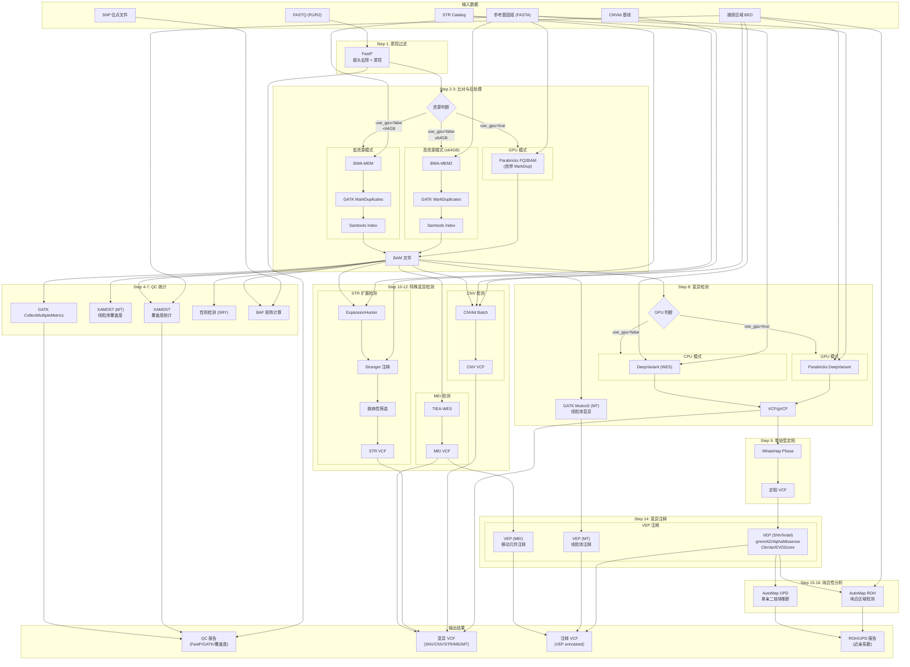

# Schema Germline Pipeline

基于 Nextflow DSL2 的全外显子胚系变异检测流程。

## 快速开始

### 1. 环境要求

- Docker
- Nextflow
- 自部署镜像已拉取（见下文）

### 2. 拉取镜像

```bash
# 流程依赖镜像
docker pull docker.schema-bio.com/schemabio/germline:v1.0.0
docker pull docker.schema-bio.com/schemabio/mapping:v1.0.0
docker pull docker.schema-bio.com/schemabio/gatk:4.6.2.0
docker pull docker.schema-bio.com/schemabio/cnvkit:0.9.13
docker pull docker.schema-bio.com/schemabio/expansionhunter:5.0.0
docker pull docker.schema-bio.com/schemabio/deepvariant:1.10.0
docker pull docker.schema-bio.com/schemabio/vep:115.2
docker pull docker.schema-bio.com/schemabio/glnexus:v1.4.1
docker pull docker.schema-bio.com/schemabio/whatshap:2.8
docker pull docker.schema-bio.com/schemabio/tiea_wes:2.0.1
docker pull docker.schema-bio.com/schemabio/automap:1.3
docker pull docker.schema-bio.com/schemabio/peddy:0.4.8
```

### 3. 准备配置文件

每个样本一个 JSON 文件，如 `examples/single.json`:

```json
{
  "sample_id": "sample1",
  "read1": "/mnt/d/data/sample1_R1.fq.gz",
  "read2": "/mnt/d/data/sample1_R2.fq.gz",
  "reference": {
    "fasta": "/mnt/d/reference/hg38.fa"
  },
  "outdir": "/mnt/d/analysis/results"
}
```

> bwa/bwa-mem2 索引文件需与 fasta 同目录同前缀，无需单独配置。

### 4. 运行流程

```bash
nextflow run main.nf \
    --config examples/single.json \
    -profile local
```

## WES_SINGLE 单人流程分析线路图



### 流程步骤详解

| 步骤 | 模块 | 功能 | 输出 |
|------|------|------|------|
| 1 | **FastP** | 接头去除、质控过滤 | clean FASTQ, QC报告 |
| 2-3 | **BWA/BWA-MEM2/Parabricks** | 序列比对 + MarkDuplicates | BAM文件 |
| 4 | **XAMDST** | 覆盖度统计 | coverage report |
| 5 | **GATK CollectMultipleMetrics** | 比对质量统计 | QC metrics |
| 6 | **SEX_CHECK_SRY** | 性别检测 | sex JSON |
| 7 | **BCFTOOLS BAF** | BAF矩阵计算 | BAF TSV/JSON |
| 8 | **DeepVariant** | SNV/Indel检测 | VCF/gVCF |
| 8b | **GATK Mutect2 (MT)** | 线粒体变异检测 | MT VCF |
| 9 | **WhatsHap** | 单倍型定相 | phased VCF |
| 10 | **CNVkit** | CNV检测 | CNV VCF |
| 11 | **ExpansionHunter + Stranger** | STR扩展检测 + 注释 | STR VCF |
| 12 | **TIEA-WES** | MEI检测 | MEI VCF |
| 14 | **VEP** | 变异功能注释 | annotated VCF |
| 15 | **AutoMap ROH** | 纯合区域检测 | ROH BED, 近亲系数 |
| 16 | **AutoMap UPD** | 单亲二倍体推断 | UPD report |

### 资源模式选择

流程会根据配置自动选择最优比对策略：

| 条件 | 比对模式 | 变异检测模式 |
|------|---------|-------------|
| `use_gpu=true` | Parabricks FQ2BAM | Parabricks DeepVariant |
| `use_gpu=false` + 内存≥64GB | BWA-MEM2 | DeepVariant CPU |
| `use_gpu=false` + 内存<64GB | BWA-MEM | DeepVariant CPU |

## License

MIT