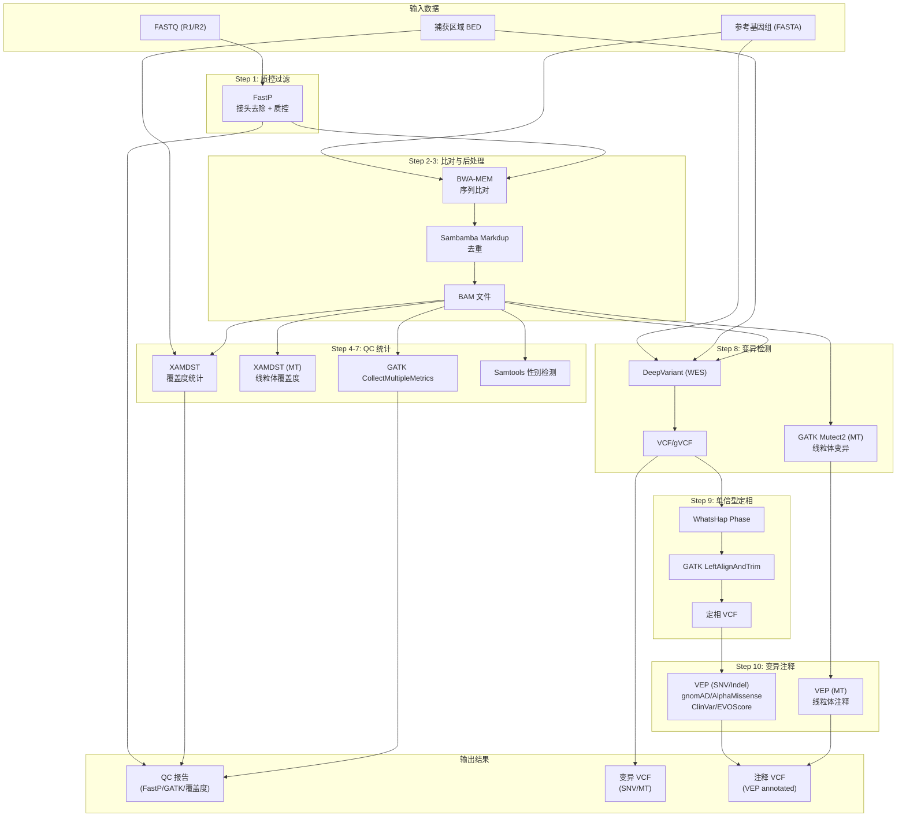

# Schema Germline Pipeline

基于 WDL 的全外显子胚系变异检测流程。

## 快速开始

### 1. 环境要求

- Docker
- miniwdl (`pip install miniwdl`)
- 自部署镜像已拉取（见下文）

### 2. 拉取镜像

```bash
docker pull docker.schema-bio.com/schemabio/gatk:4.6.2.0
docker pull docker.schema-bio.com/schemabio/deepvariant:1.10.0
docker pull docker.schema-bio.com/schemabio/vep:115.2
docker pull docker.schema-bio.com/schemabio/whatshap:2.8
docker pull docker.schema-bio.com/schemabio/mapping:v1.0.0
```

### 3. 准备配置文件

每个样本一个 JSON 文件，如 `inputs/single.json`:

```json
{
    "SingleWES.prefix": "proband",
    "SingleWES.read_1": "/mnt/data/test/sample_R1.fq.gz",
    "SingleWES.read_2": "/mnt/data/test/sample_R2.fq.gz",
    "SingleWES.fasta": "/database/hg38.fa",
    "SingleWES.bed": "/mnt/data/test/capture.bed",
    "SingleWES.flank_size": 50,
    "SingleWES.assembly": "GRCh38",
    "SingleWES.ref_dir": "/database",
    "SingleWES.cache_dir": "/database/vep",
    "SingleWES.schema_bundle": "/database/schema_bundle",
    "SingleWES.tmp_dir": "/tmp_workspace"
}
```

> bwa 索引文件需与 fasta 同目录同前缀，无需单独配置。

### 4. 配置 miniwdl

创建 `conf/local.cfg` 配置 Docker 挂载和资源：

```ini
[core]
max_tasks = 32

[task_runtime]
defaults = {
    "docker": "germline:v1.0.0",
    "cpu": 2,
    "memory": "4G",
    "mounts": [
        "/mnt/data/database:/database:ro",
        "/mnt/data/temp_workspace:/tmp_workspace:rw"
    ]
}

[file_io]
root = /mnt/data
```

### 5. 运行流程

```bash
miniwdl run single.wdl \
    --cfg conf/local.cfg \
    -i inputs/single.json \
    --dir /mnt/data/output
```

## WES_SINGLE 单人流程分析线路图



### 流程步骤详解

| 步骤 | 模块 | 功能 | 输出 |
|------|------|------|------|
| 1 | **FastP** | 接头去除、质控过滤 | clean FASTQ, QC报告 |
| 2 | **BWA-MEM** | 序列比对 | BAM文件 |
| 3 | **Sambamba Markdup** | 去重 | dedup BAM |
| 4 | **XAMDST** | 覆盖度统计 | coverage report |
| 5 | **GATK CollectMultipleMetrics** | 比对质量统计 | QC metrics |
| 6 | **Samtools SexCheck** | 性别检测 | sex JSON |
| 7 | **XAMDST (MT)** | 线粒体覆盖度统计 | MT coverage |
| 8 | **DeepVariant** | SNV/Indel检测 | VCF/gVCF |
| 8b | **GATK Mutect2 (MT)** | 线粒体变异检测 | MT VCF |
| 9 | **WhatsHap** | 单倍型定相 | phased VCF |
| 10 | **VEP** | 变异功能注释 | annotated VCF |

## 项目结构

```
schema-germline/
├── single.wdl           # 单人WES分析主流程
├── tasks/
│   ├── fastp.wdl        # 质控
│   ├── bwamem.wdl       # 比对
│   ├── sambamba.wdl     # 去重
│   ├── samtools.wdl     # 性别检测
│   ├── xamdst.wdl       # 覆盖度统计
│   ├── gatk.wdl         # GATK工具集
│   ├── deepvariant.wdl  # 变异检测
│   ├── whatshap.wdl     # 定相
│   └── vep.wdl          # 变异注释
├── inputs/
│   └── single.json      # 输入参数示例
├── conf/
│   └── local.cfg        # miniwdl配置示例
└── assets/
    └── mito.bed          # 线粒体区域BED
```

## License

MIT